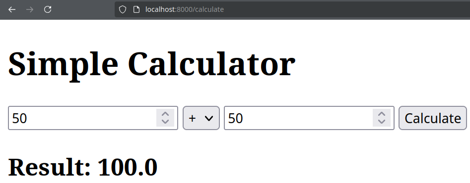
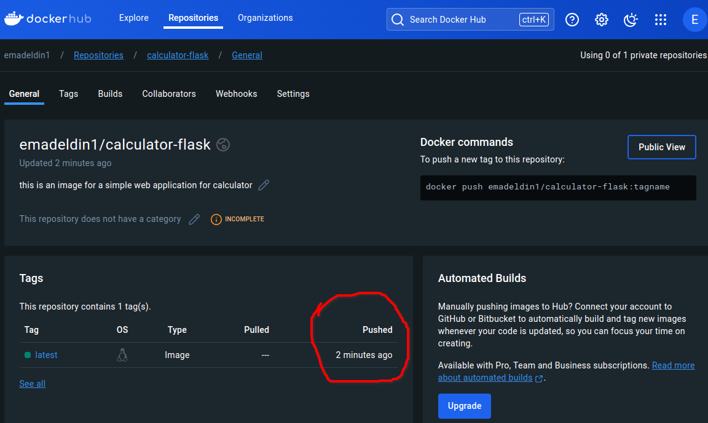
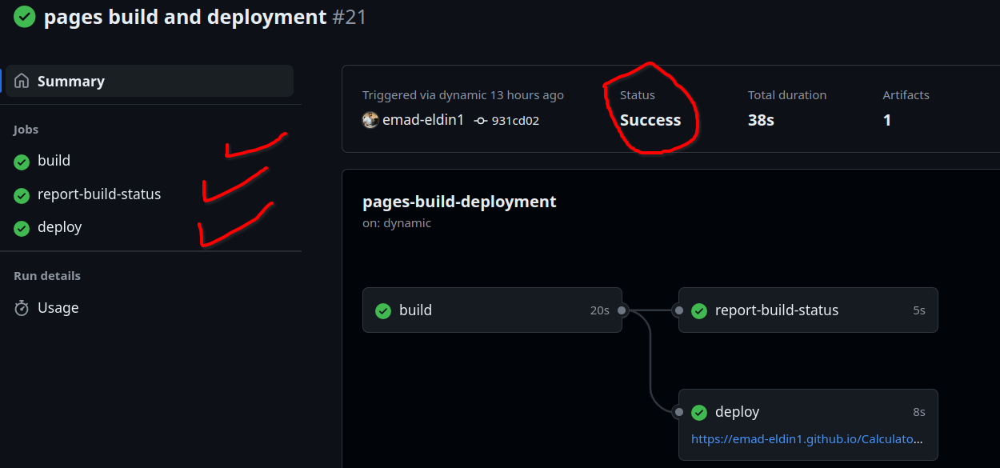
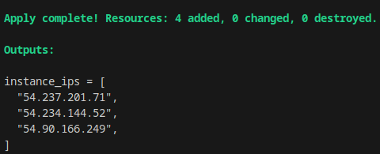
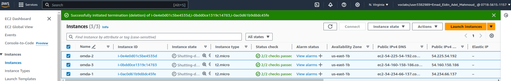
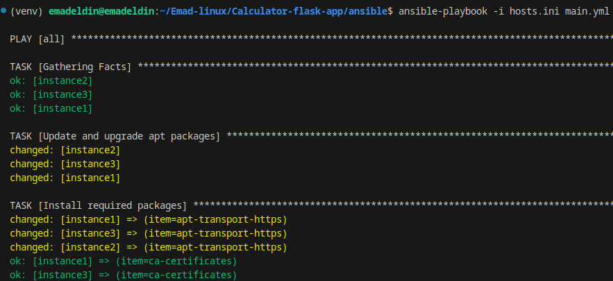

# Flask Calculator Web Application


This is a simple calculator web application built using Flask, Dockerized for easy deployment. The application allows you to perform basic arithmetic operations such as addition, subtraction, multiplication, and division.

## Prerequisites

Before you begin, ensure you have the following installed on your machine:

1. **Docker**
2. **Python 3.9** 
3. **Flask==2.1.2** 
4. **Werkzeug==2.0.3**
5. **Ansible** 
6. **terraform**
7. **Cloud provider (AWS)**

## Directory Structure

Your project directory should look like this:

```
calculator/
│
├── app.py
├── Dockerfile
├──.dockerignore
├──.gitignore
├── venv
├── requirements.txt
├── test_app.py
└── templates/
|   └── index.html
├──.github/workflows
|            └── git-action.yml
├──ansible 
|        └──ansible.cfg
|        └──main.yml   
|        └──hosts.ini       
|        └──vockey.pem
├──terraform    
|        └──main.tf    
|        └──output.tf
|        └──providers.tf
|        └──security.tf
|        └──variables.tf
|        └──vockey.pem


```
## Running the Application Locally (Without Docker):
### If you prefer to run the application locally without Docker, follow these steps:
1. Create and activate a virtual environment:
```
python3 -m venv venv
source venv/bin/activate
```
2. Install Dependencies:
```
pip install -r requirements.txt
```
3. Run the Application:
```
python3 app.py
```
### The application should now be accessible at http://localhost:8000 in your web browser.

## Running Tests
```
python3 -m unittest test_app.py
```

-----
# For Running by using Dockerization :
## 1. Build & Run Docker Image:
```
docker build -t calculator-app .
docker run -p 8000:8000 calculator-app
```


## 2. Push to Docker Hub:

#### Step 1: Tag Your Docker Image
```
docker tag calculator-app:latest emadeldin1/calculator-flask
```
#### Step 2: Login to Docker Hub
```
docker login
```
#### Step 3: Push to Docker Hub
```
docker push emadeldin1/calculator-flask:latest 
```

---------------------
## 3. Run The application Using Ansible-playbook
#### step 1: test the proccess before building
```
ansible-playbook ansible-playbook.yml --check
```
#### step 2: Run The application
```
ansible-playbook ansible-playbook.yml
```
---------


# Github Action Steps : 

#### Step 1: Update your Requirements :
```
pip freeze > requirements.txt
```
#### Step 2: push to github
```
git add .
git commit -m ""
git push origin main
```
## Successful workflow :<i>by running the github action the continuous integration proccess will be done</i>

--
# Provisioning Three EC2 Instances on AWS Using Terraform :

### Step 1: Create a file named main.tf with the following content:
```
provider "aws" {
  region = "us-east-1"  # Change to your preferred region
}

resource "aws_instance" "example" {
  count         = 3
  ami           = "ami-0c55b159cbfafe1f0"  # Replace with your desired AMI ID
  instance_type = "t2.micro"  # Choose the instance type based on your requirements

  tags = {
    Name = "example-instance-${count.index}"
  }
} #Adjust the ami and region to match your needs.
```
### step 2: Initialize Terraform : 
```
terraform init
```
### step 3: Plan the Deployment : 
```
terraform plan
terraform apply
```
and this will output the three ip's of launched instances



### step 4 : Verify the Instances:
 After the apply process completes, you can check your AWS Management Console under the EC2 section to see the running instances:


### Clean Up Resources : 
If you want to delete the instances and clean up resources, use the following command:
```
terraform destroy
```
--------
# Automating Install for required Packages Using Ansible-playbook : 
### step 1: Create an Ansible hosts(Inventory) File :
Create a file named hosts.ini with the following content:
```
[ec2_instances]
instance1 ansible_host=YOUR_EC2_INSTANCE_1_IP
instance2 ansible_host=YOUR_EC2_INSTANCE_2_IP
instance3 ansible_host=YOUR_EC2_INSTANCE_3_IP

[ec2_instances:vars]
ansible_user=ubuntu  # Change if using a different user
ansible_ssh_private_key_file=/path/to/your/private_key.pem
```
### step 2: Create a file named inventory.ini with the following content:
```
ansible-playbook -i hosts.ini <name of your ansible yaml file>
```

--------
# for clone the repository : 
```
https://github.com/emad-eldin1/Calculator-flask-app.git
```
-------
